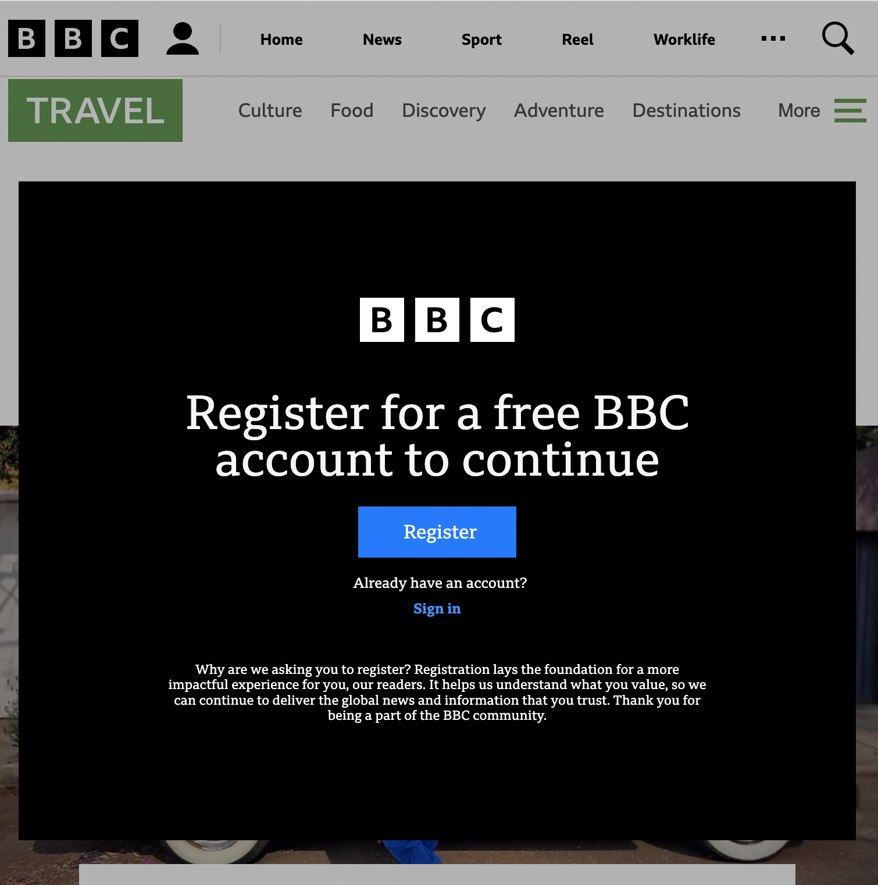

# Chrome Extension that removed the registration splash on the BBC

The BBC recently added a force registration flow to their website.

 

This plugin will remove this splash screen so you can read without interruption

Icon by [Comic icons created by Freepik - Flaticon](https://www.flaticon.com/free-icons/comic)
